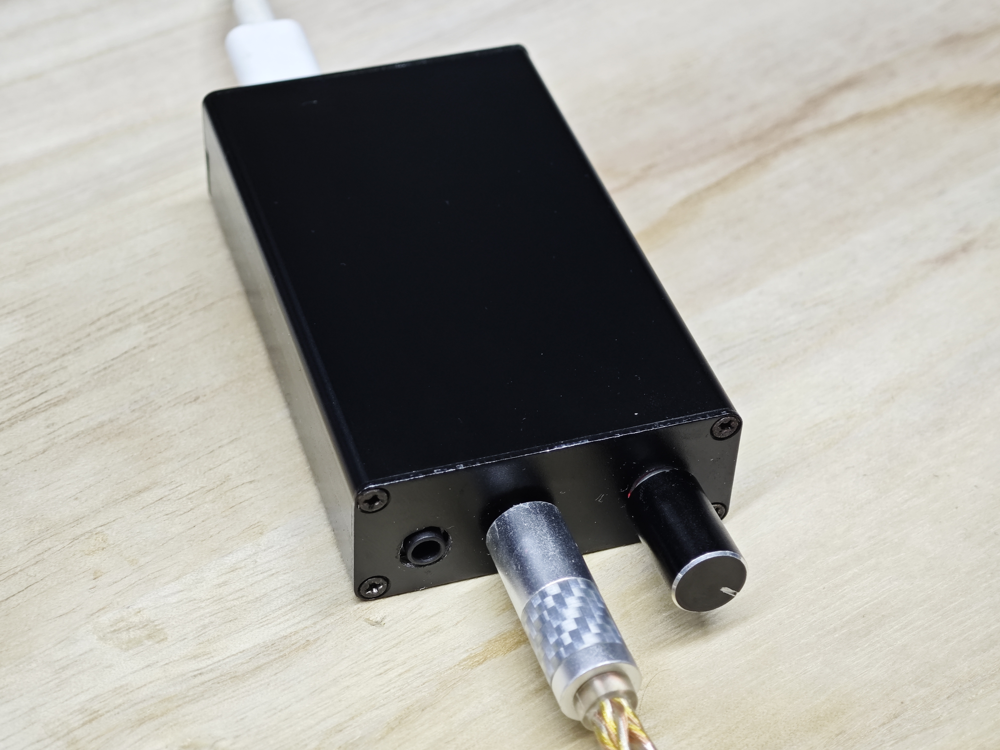
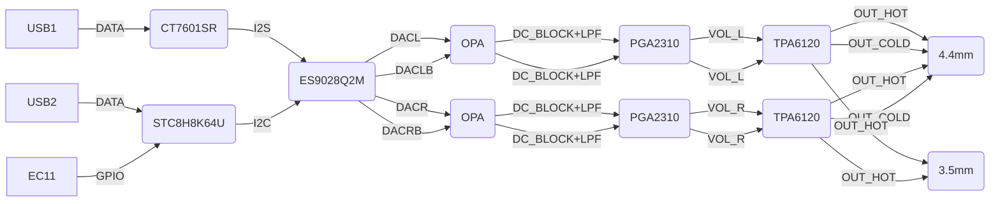
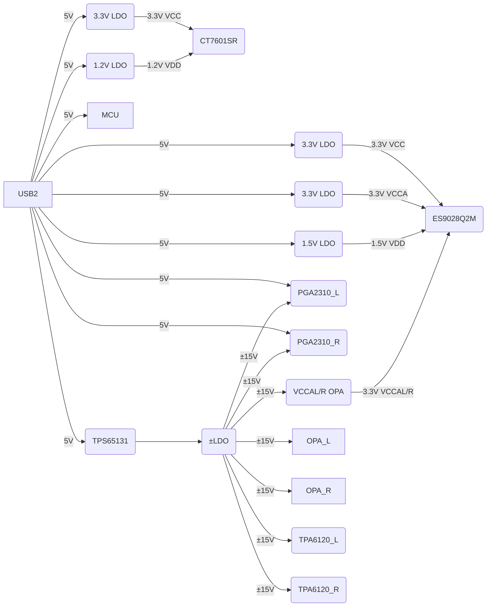
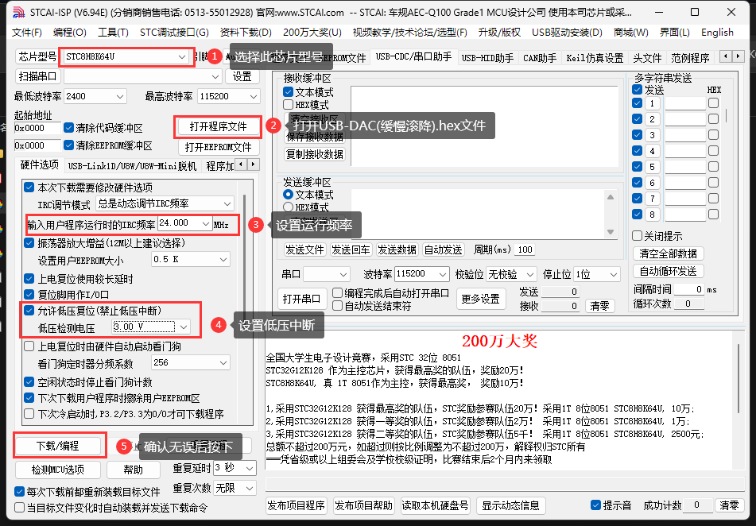
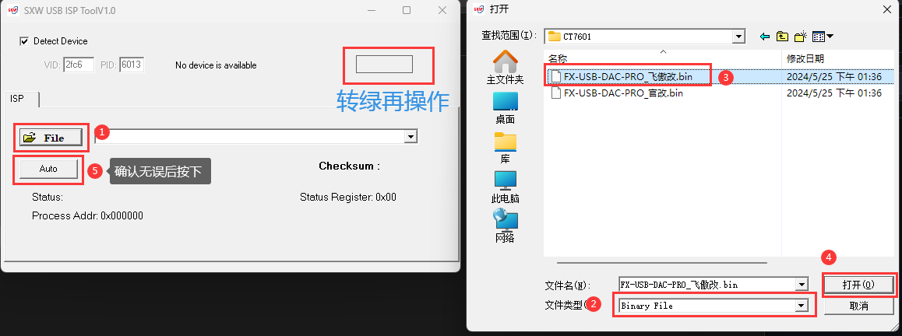

# USB-DAC
 基于CT7601与STC8H8K64U的USB小型耳机放大器  
   

# 特点
 1. 在小尺寸下放入了完整正负15V电源，高输出功率(1000mW)与高摆幅(Vpp~30V)  
 2. 模拟音量调节，完美解决精度丢失，254档极细粒度，实现类无极调节  
 3. 极好的声道平衡度(<0.1dB)  
 4. USB集成UAC2.0及UAD协议，全平台可用  
 5. 拥有完整的HIFI信号链，包含前置放大电路，最大前置放大+32dB  
 6. 使用通用SOP8运放封装，方便烧友磨机  
 7. 单端平衡双输出  
 8. 包含独立供电接口，接入后自动关闭主供电  

# 设计框图
## 数据框图

## 电源框图

# DIY指南
**本项目大部分元件使用0603/QFN等小型封装设计,具有一定的焊接难度,请准备好合适的工具**

## 准备工具及材料
 1. 一把合适的烙铁,推荐T12(不要弄那些几十块的那种来焊,你会自闭的)  
 2. 加热台,买淘宝那种十几块的LED拆焊台即可(非必须)  
 3. 万用表
 4. 镊子
 5. 台钻/手钻
 6. 锉刀

## 材料  
 1. 有铅中温锡膏(用以焊接贴片元件,非必须)
 2. 焊锡丝
 3. 助焊剂/焊宝/松香(辅助焊接)
 4. 打样的模拟板+数字板PCB
 5. [此目录下的元件](https://github.com/fangxx3863/USB-DAC-PRO/tree/main/extra)

## 开始制作  
### 焊接(加热台法,推荐)  
 1. 将所有焊点涂上焊膏,注意量不要太多  
 2. 使用立创专业版的辅助焊接工具对照3D预览将元件全部用镊子小心放置于焊盘上  
 3. 将PCB移至加热台加热,待焊锡融化后用镊子将未归位的元件推齐  
 4. 完成后将电路板放于地板加速冷却  
 5. 接着打开烙铁,用刀头处理MCU引脚,防止连锡  
 6. 确认焊接无误最后焊接剩余直插元件  
 7. 焊接完成  

### 焊接(烙铁法)  
 1. 在全部阻容,LED,二极管位置用烙铁上一边焊盘的锡
 2. 使用立创专业版的辅助焊接工具对照3D预览将元件用镊子小心放置于焊盘上  
 3. 烙铁加热有锡一边焊盘直到元件紧贴PCB平面  
 4. 在另一侧焊盘用烙铁上锡  
 5. 直至全部阻容,LED,二极管焊接完成(注意二极管方向)  
 6. 于MCU焊盘上涂大量焊油  
 7. 放上MCU,加焊锡用刀头拖好(注意元件方向)  
 8. 确认其他焊接无误最后焊接直插元件  
 9. 焊接完成  

### 上传程序  
#### MCU程序
 1. 进入[预构建文件](https://github.com/fangxx3863/USB-DAC-PRO/tree/main/extra/STC8H8K64U)下载最新预构建文件 (USB-DAC(缓慢滚降).hex)  
 2. 下载[STC-ISP](https://github.com/fangxx3863/USB-DAC-PRO/blob/main/extra/STC8H8K64U/stcai-isp-v6.94E.exe)下载工具  
 3. 打开STC-ISP并按下图设置     
 4. 确认无误后点击下载/编程  
 5. 按住主板的USB-ISP按钮的同时插入靠近DCDC部分的USB线,如无意外则程序自动开始下载  
 6. 如果未开始下载,请重复上述步骤  
 7. 等待下载完成即可  

#### USB桥程序
 1. 进入[预构建文件](https://github.com/fangxx3863/USB-DAC-PRO/tree/main/extra/CT7601)下载最新预构建文件 (FX-USB-DAC-PRO_飞傲改.bin)  
 2. 下载[SXW-ISP](https://github.com/fangxx3863/USB-DAC-PRO/blob/main/extra/CT7601/SXW_ISP_Tool.rar)下载工具  
 3. 打开SXW-ISP并按下图设置     
 4. 插入靠近USB桥片部分的USB线  
 5. 确认无误后点击AUTO   
 6. 如果未开始下载,请重复上述步骤  
 7. 等待下载完成即可 

### 组装  
 1. 使用游标卡尺等工具对壳体面板做标记  
 2. 使用台钻开出主要孔位  
 3. 使用锉刀修整开孔
 4. 连接20P排线，并将PCB滑入壳体开槽  
 5. 上紧全部螺丝

# 二次开发
 1. 克隆本项目并用VSCode打开  
 2. 安装Keil5 C51与VSCode EIDE插件并配置好构建器  
 3. 点开EIDE图标展开EIDE项目,构建选项  
 4. 点击构建器选项旁边的笔图标  
 5. 进入全局选项选项卡将RAM/ROM模式均改为LARGE,并点击右上角全部保存按钮  
 6. 程序修改完毕后按右上角下载图标即可完成编译  

# 不足
由于高电压加之模拟器件众多，空载功率约4W，发热较大，需要良好通风环境下使用  